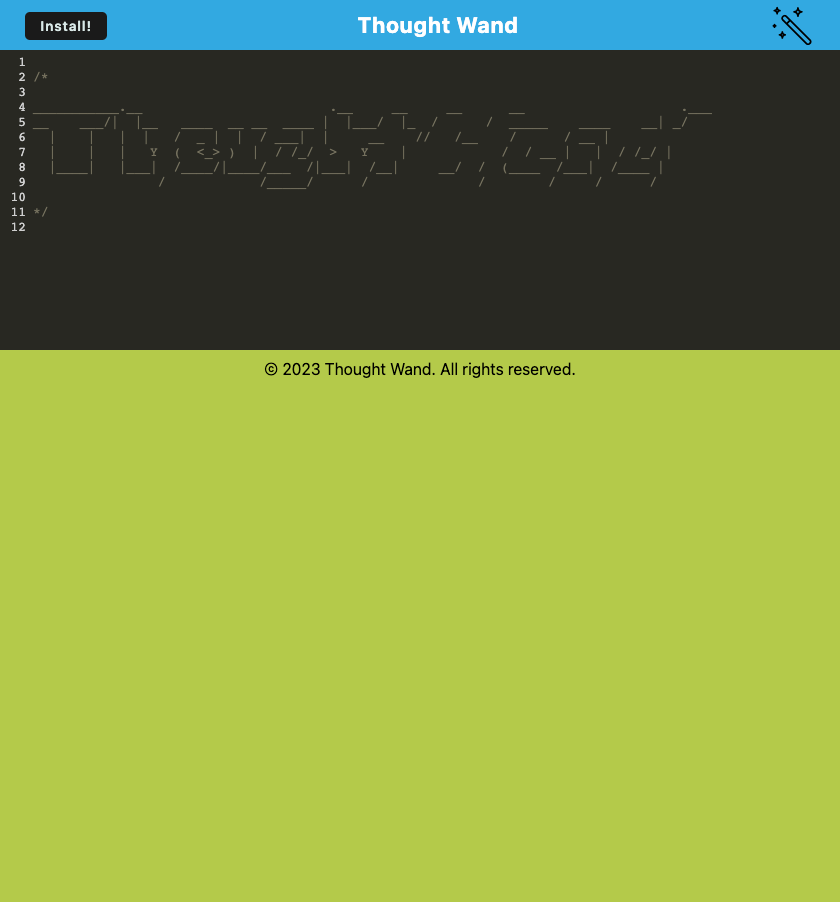

# Thought Wand - Progressive Web Applications (PWA) Challenge: Text Editor

The Thought Wand project is a text editor web application that enables users to create and store notes or code snippets with or without an internet connection. It incorporates Progressive Web Application (PWA) principles, allowing for offline access and data persistence. This project showcases advanced concepts and techniques learned throughout the course.

![Screenshot of My Application]

[Link to My Video, How To Save: ](https://drive.google.com/file/d/1ta5aGqpTH4g_V8Q_LRWgBIJkjzGRPQJ7/view?usp=sharing)

## Features

- Create and store notes or code snippets with a user-friendly text editor.
- Offline functionality for seamless usage even without an internet connection.
- Data persistence using IndexedDB for reliable storage and retrieval of content.
- Bundling of JavaScript files using webpack for optimized performance.
- Generation of HTML, service worker, and manifest files with webpack plugins.
- Support for next-gen JavaScript while ensuring cross-browser compatibility.
- Installation option to download the web application as a desktop icon.
- Registration of a service worker using Workbox for offline caching.
- Deployment to Heroku with proper build scripts for a webpack application.

## Installation and Usage

1. Clone the repository and navigate to the project's root directory.
2. Run `npm install` to install the necessary dependencies.
3. Execute `npm run start` to start the application's backend and serve the client.
4. Access the text editor application by opening it in your preferred web browser.

## Technologies Used

- JavaScript
- HTML
- CSS
- IndexedDB
- Webpack
- Workbox
- Heroku

## Project Structure

The project follows a client-server folder structure:

- `/client` directory: Contains the client-side code, including the text editor interface.
- `/server` directory: Contains the server-side code for backend functionality.
- `/public` directory: Holds static assets such as images and stylesheets.

## Contributions

Contributions to the Thought Wand project are welcome! If you have any suggestions, improvements, or bug fixes, please submit a pull request.

## License

The Thought Wand project is licensed under the [MIT License](LICENSE).

## Acknowledgements

The Thought Wand project was developed as part of a Progressive Web Applications (PWA) challenge, utilizing the knowledge and skills gained during the course. Special thanks to the course instructors and contributors for their guidance and support.

Live Heroku Link:

https://thought-wand-c2087ec758f7.herokuapp.com/

GitHub Link:

https://github.com/Keegan-Omel/Thought-Wand

